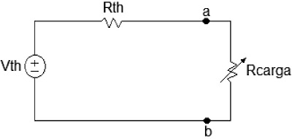
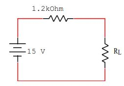
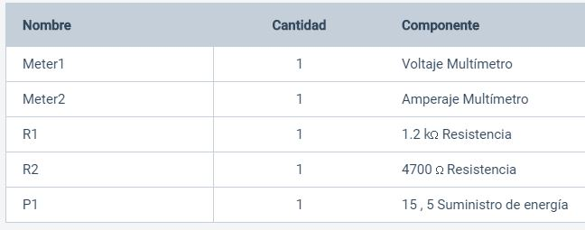

# Informe-6
#  TEOREMA DE LA MÁXIMA TRANSFERENCIA DE POTENCIA.

## OBJETIVOS

Analizar los datos en una carga eléctrica para obtener la optimización del valor de la carga eléctrica que permita la máxima transferencia depotencia de un circuito a la carga.

**Objetivos específicos:** 
 - Identificar en el circuito las mediciones de voltajes correspondiente
   a las resistencias segun el Teorema DE La máxima Transferencia De Potencia.
 - Demostrar si se cumple el Teorema DE La máxima Transferencia De Potencia con el voltaje y la   
   corriente en el circuito propuesto.   
 - Comprobar los resultados y los datos necesarios  del  circuito 
       propuesto, demostrando el Teorema DE La máxima Transferencia De Potencia.
## MARCO TEÓRICO

El teorema de máxima transferencia de potencia es importante cuando se tiene que conocer el valore de la carga con la cual la fuente suministra la máxima potenciaPara una fuente de voltaje dada, la potencia máxima se transfiere desde una fuente hasta una carga cuando la resistencia de la carga es igual a la resistencia interna de la fuente.La resistencia de la fuente Rs de un circuito es la resistencia equivalente vista desde la terminal de salida utilizando Thevenin, se puede transferir la máxima potencia posible de la fuente de la carga solocuando RL es igual a Rs.

<section>
      

                   
   

   </section>
  

La aplicación de este teorema se amplía en basea toda red, por compleja que sea, puedereducirse a una red con una fuente de voltaje yuna resistencia serie, mediante la aplicación delteorema de Thevenin. La máxima transferenciade potencia ocurre entonces cuando la resistencia de carga es igual a la resistencia de Thevenin.

Los sistemas eléctricosse diseñan para llevar la potencia a la carga conla mayor eficiencia, al reducir las pérdidas en laslíneas de potencia. Por ello, el esfuerzo se centraen reducir RTH que representaría la resistencia dela  fuente más la de la línea.Por eso resulta atractiva la idea de usar líneas super conductoras que no ofrezcan resistencia   para transmitir potencia. (Dorf & Svoboda, 2006, pág. 170)

## **DESCRIPCIÓN DE LOS EQUIPOS Y MATERIALES**

**Fuente de voltaje C.D.** Es de donde conseguir electricidad para el circuito
<section>
      

                   
   

   </section>
   
**Multímetro digital**. Nos ayudara para poder hacer las mediciones de la practica
</section>
      

                   
   

   </section>

**Resistores** de  220Ω,470Ω, 680Ω, 820Ω, 1kΩ, 1.5kΩ, 1.8kΩ, 2.2kΩ, 3.9kΩ y 4.7kΩ.  Los utilizaremos para crear el circuito que vamos a medir
</section>
      

                   
   

   </section>

**Protoboard.** Es la base en la cual se va a formar el circuito con los elementos de este.
</section>
      

                   
   

   </section>
 

## **PROCEDIMIENTO**

Arme el circuito que se muestra en la figura 5.1.

</section>
      

                   
   

   </section>

Mida el voltaje y la corriente para cada valor de RL que se indica en la tabla 6.1.
Anote los resultados medidos.
 
 Desconecte el resistor R5 y mida el voltaje en el circuito abierto. Anote el valor
medido en la tabla 5.1.

Calcule las potencia consumida por RL, para cada valor dado y anote los
resultados en la tabla 6.1.

***Tabla 6.1. Parámetros Eléctricos del circuito de la figura 6.1***
| RL(Ω)   |Corriente Medida(mA)|Voltaje Medido(V)|Potencia Calculada Experimentalmente(W)|Potencia Calculada Teóricamente(W)|
|---------|---------|---------|---------|-|
|**220** |10.6|2.32|0.024|0.025|
|**470** |8.98|4.22|0.037|0.037|
|**680** |7.98|5.43|0.043|0.043|
|**820** |7.43|6.09|0.045|0.045|
|**1000**|6.82|6.82|0.046|0.046|
|**1500**|5.56|8.33|0.046|0.046|
|**1800**|5.00|9.00|0.045|0.045|
|**2200**|4.41|9.71|0.042|0.042|
|**3900**|2.94|11.5|0.033|0.033|
|**4700**|2.54|11.9|0.030|0.030|

calculos

</section>
      

                   
   

   </section>
   
   
**6.5.4. ¿Se cumple el Teorema de la Máxima Transferencia de Potencia?**

 Si cumple el teorema de la Máxima Transferencia de Potencia porque el teorema dice que cuando la recistencia RL es igual a Rs va a tener la máxima transferencia de potencia entonces observando los calculos vemos que mientras la recistencia tiende a ser igual a la resistencia dada tiene una mayor potencia, mientras que cuando se pasa el valor de la resistencia baja el valor de la potencia.

6.5.5. ¿Cuál fue la potencia máxima en RL? 0.046 Watts
6.5.6. ¿Para qué valor de RL se obtiene la MTP? 1000Ω y de 1500Ω empieza a descender.  

## **DIAGRAMAS**
<section>
      

                   
   

   </section>
   
## **LISTA DE COMPONENTES**

 </section>
      

                   
   

   </section>

## **CONCLUSIONES**

La potencia máxima será desarrollada en la carga cuando la resistencia decarga RL sea iguala la resistenciainterna de la fuente Ri.

Para obtener la máxima transferencia de potencia debe adaptarse la resistencia interna en las fuentes de voltaje.

## **RECOMENDACIONES**

Se establecen en función del proyecto y constituyen la base para un funcionamiento adecuado.

## **CRONOGRAMA**

 </section>
      

                   
   

   </section>
  

  

# **BIBLIOGRÁFICA**

William H. Hayt, J., Kemmerly, J. E., & Durbin, S. M. (2012). Análisis de circuitos en ingenieria. Buffalo: Mc Graw Hill.
Vásquez, J. R. G. (s. f.). TEOREMAS FUNDAMENTALES DE CIRCUITOS ELÉCTRICOS. 251.

## **ANEXOS**
https://github.com/attoala/Informe-6/tree/master/Anexos
 
