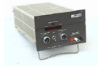
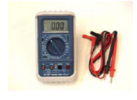

# Informe-6
#  TEOREMA DE LA MÁXIMA TRANSFERENCIA DE POTENCIA.

## OBJETIVOS

Comprobar experimentalmente el Teorema DE La máxima Transferencia De Potencia.

**Objetivos específicos:** 
 - Identificar en el circuito las mediciones de voltajes correspondiente
   a las resistencias segun el Teorema DE La máxima Transferencia De Potencia.
 - Demostrar si se cumple el Teorema DE La máxima Transferencia De Potencia con el voltaje y la   
   corriente en el circuito propuesto.   
 - Comprobar los resultados y los datos necesarios  del  circuito 
       propuesto, demostrando el Teorema DE La máxima Transferencia De Potencia.
## MARCO TEÓRICO

“Se aplica a circuitos lineales con una carga que puede ser lineal o no lineal, variantes o invariantes con el tiempo cuyo estado energético sea nulo o no. Permite reemplazar un circuito de análisis complejo por uno equivalente de menos tamaño que facilite el cálculo de los efectos externos (circuito equivalente), puede usar en sistemas de potencia para analizar partes de él y reemplazando en resto del sistema de esta forma.” (Vásquez, s. f.)

<section>
      

                   
   

   </section>
  

Para mayor entendimiento de este teorema, se refiere que a cualquier circuito se le puede reducir a solo una fuente con 2 resistores, para un calculo mucho mas fácil, y para lograrlo se debe quitar el elemento a analizar y encontrar un voltaje entre los puntos donde estaba ese elemento y la resistencia equivalente de los demás elementos del circuito, para el calculo de resistencia equivalente las fuentes de tensión se convierten en cortocircuitos y las de corriente en circuitos abiertos. Así con esos 2 valores denominados Resistencia de Thévenin (RTH) y voltaje de Thévenin (VTH) para esa resistencia equivalente conseguida y ese voltaje de los puntos a y b respectivamente. Una vez con esos datos se vuelve a introducir el elemento en cuestión a calcular y re desarrolla el circuito

## **DESCRIPCIÓN DE LOS EQUIPOS Y MATERIALES**

**Fuente de voltaje C.D.** Es de donde conseguir electricidad para el circuito
<section>
      

                   
   

   </section>
   
**Multímetro digital**. Nos ayudara para poder hacer las mediciones de la practica
</section>
      

                   
   

   </section>

**Resistores** de 1kΩ, 100Ω, 330Ω, 4.7kΩ y 560Ω. Los utilizaremos para crear el circuito que vamos a medir
</section>
      

                   
   

   </section>

**Protoboard.** Es la base en la cual se va a formar el circuito con los elementos de este.
</section>
      

                   
   

   </section>
 
**Potenciómetro.** Un potenciómetro es un resistor eléctrico con un valor de resistencia variable y generalmente ajustable manualmente.
</section>
      

                   
   

   </section>

## **PROCEDIMIENTO**

Arme el circuito que se muestra en la figura 5.1.

</section>
      

                   
   

   </section>

Mida el voltaje y la corriente para cada valor de RL que se indica en la tabla 6.1.
Anote los resultados medidos.
 
 Desconecte el resistor R5 y mida el voltaje en el circuito abierto. Anote el valor
medido en la tabla 5.1.

Calcule las potencia consumida por RL, para cada valor dado y anote los
resultados en la tabla 6.1.

***Tabla 6.1. Parámetros Eléctricos del circuito de la figura 6.1***

| RL(Ω)   |Corriente Medida(mA)|Voltaje Medido(V)|Potencia Calculada Experimentalmente(W)|Potencia Calculada Teóricamente(W)|
|---------|---------|---------|---------|---------|---------|---------|
|**220** |10.6|2.32|0.024 |0.025|
|**470** |8.98|4.22|0.037 |0.037|
|**680** |7.98|5.43|0.043 |0.043|
|**820** |7.43|6.09|0.045 |0.045|
|**1000**|6.82|6.82|0.046 |0.046|
|**1500**|5.56|8.33|0.046 |0.046|
|**1800**|5.00|9.00|0.045 |0.045|
|**2200**|4.41|9.71|0.042 |0.042|
|**3900**|2.94|11.5|0.033 |0.033|
|**4700**|2.54|11.9|0.030 |0.030|

## **DIAGRAMAS**
<section>
      

                   
   

   </section>
   
## **LISTA DE COMPONENTES**

 </section>
      

                   
   

   </section>

## **CONCLUSIONES**

El teorema de Thévenin se basa en el análisis de los circuitos con el propósito de poder encontrar el voltaje de un circuito abierto, hallando matemáticamente y experimental los valores correspondientes, que consiste, que el valor de las resistencias puede ser reemplazada o sustituida por otra fuente de tensión.

En conclusión, emplear el teorema de Thévenin resulta practico para reducir componentes, aparte de considerar la comprobación de los resultados mediante un simulador y evidenciar que el porcentaje de error es mínimo.

Al acabar la simulación, se concluye que todo circuito lineal activo puede ser reducido por un circuito equivalente serie (Thévenin), confirmando  su utilidad.

## **RECOMENDACIONES**

Se establecen en función del proyecto y constituyen la base para un funcionamiento adecuado.

## **CRONOGRAMA**

 </section>
      

                   
   

   </section>
  

  

# **BIBLIOGRÁFICA**

William H. Hayt, J., Kemmerly, J. E., & Durbin, S. M. (2012). Análisis de circuitos en ingenieria. Buffalo: Mc Graw Hill.
Vásquez, J. R. G. (s. f.). TEOREMAS FUNDAMENTALES DE CIRCUITOS ELÉCTRICOS. 251.

## **ANEXOS**
https://github.com/fernandoSando/informe-5/tree/master/Anexos
 
